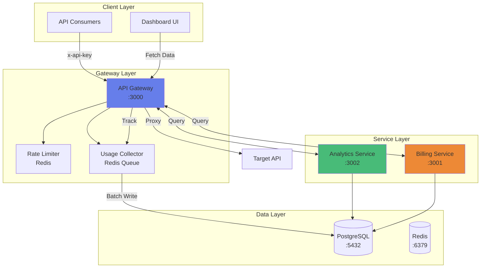
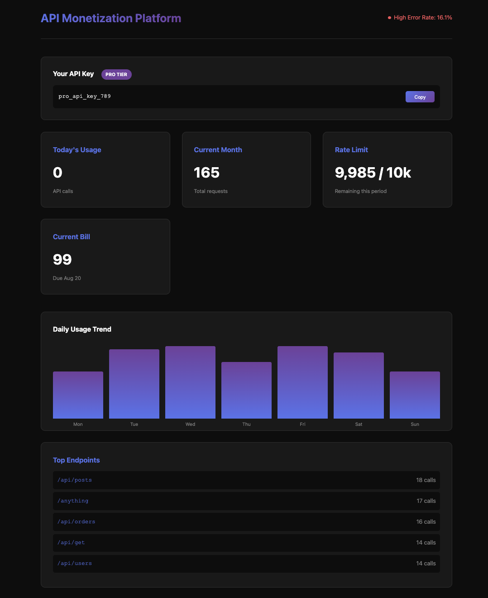

# API Monetization Platform 🚀

<div align="center">


**Transform any API into a revenue-generating service in minutes**


</div>

## 🎯 Overview

A production-ready platform that allows any company with an API to add enterprise-grade billing, rate limiting, and usage analytics without modifying their existing infrastructure. Think "Stripe for APIs" - companies integrate our gateway, and we handle all their API monetization needs.

**Why I Built This**: To demonstrate my ability to architect and build complex distributed systems that solve real business problems. This project showcases microservices architecture, database design, caching strategies, background processing, and clean code practices.

## ✨ Features

### 🏢 For API Providers
- **Zero-Code Integration** - Just point your customers to our gateway
- **Automated Billing** - Monthly invoices with usage-based pricing
- **Real-time Analytics** - Track API usage, popular endpoints, and error rates
- **Flexible Pricing Tiers** - From FREE to ENTERPRISE with custom rate limits
- **Customer Management** - API key generation and lifecycle management

### 👥 For API Consumers
- **Simple Authentication** - One header, unlimited access
- **Usage Dashboard** - Real-time metrics and billing information
- **Transparent Pricing** - Know exactly what you'll pay
- **High Performance** - Minimal latency overhead with Redis caching

## 🏗️ Architecture



### 🔧 Tech Stack

<table>
<tr>
<td>

**Backend**
- NestJS + TypeScript
- PostgreSQL + Prisma ORM
- Redis (Caching + Rate Limiting)
- Docker & Docker Compose
- NestJS Schedule (Background Jobs)

</td>
<td>

**Features**
- RESTful API Design
- Swagger Documentation
- API Key Authentication
- Microservices Architecture
- Scheduled Background Jobs
- Unit Testing with Jest

</td>
<td>

**DevOps**
- Docker Containerization
- Health Checks
- Environment Configuration
- Database Migrations
- Automated Seeding

</td>
</tr>
</table>

## 🚀 Quick Start

### Prerequisites
- Docker & Docker Compose
- Node.js 18+ (for local development)
- 4GB RAM minimum

### 🐳 Docker Setup (Recommended)

1. **Clone the repository**
```bash
git clone https://github.com/korberlin/api-monetization-platform.git
cd api-monetization-platform
```

2. **Configure environment**
```bash
cp .env.example .env
# Edit .env with your settings
```

3. **Start all services**
```bash
chmod +x docker-helper.sh
./docker-helper.sh build
./docker-helper.sh start
./docker-helper.sh migrate
./docker-helper.sh seed
```

4. **Access the platform**
- 🌐 Gateway: http://localhost:3000
- 📊 Dashboard: http://localhost:3000/dashboard.html
- 📚 API Docs: http://localhost:3000/docs
- 🔧 Admin API: Use `x-admin-key: admin_secret_123`

### 🛠️ Manual Setup

<details>
<summary>Click to expand manual setup instructions</summary>

1. **Install PostgreSQL and Redis**
```bash
# macOS
brew install postgresql redis
brew services start postgresql
brew services start redis

# Ubuntu
sudo apt update
sudo apt install postgresql redis-server
sudo systemctl start postgresql redis
```

2. **Setup databases**
```bash
createdb api_monetization
```

3. **Install dependencies**
```bash
# Gateway service
cd apps/gateway
npm install
npx prisma migrate deploy
npx prisma db seed

# Analytics service
cd ../analytics
npm install

# Billing service
cd ../billing
npm install
```

4. **Start services**
```bash
# Terminal 1 - Gateway
cd apps/gateway
npm run start:dev

# Terminal 2 - Analytics
cd apps/analytics
npm run start:dev

# Terminal 3 - Billing
cd apps/billing
npm run start:dev
```

</details>

## 📖 API Documentation

### 🔐 Authentication

All API requests require authentication:
- **Customer endpoints**: Use `x-api-key` header
- **Admin endpoints**: Use `x-admin-key` header

```http
x-api-key: your_api_key_here
# or for admin
x-admin-key: admin_secret_123
```

### 🌐 Proxy Endpoints
*All customer API traffic flows through these endpoints*

```bash
# Route any HTTP method through the gateway
GET     /api/*          # Proxy GET requests
POST    /api/*          # Proxy POST requests  
PUT     /api/*          # Proxy PUT requests
DELETE  /api/*          # Proxy DELETE requests
PATCH   /api/*          # Proxy PATCH requests
OPTIONS /api/*          # Proxy OPTIONS requests
HEAD    /api/*          # Proxy HEAD requests

# Examples:
GET http://localhost:3000/api/users
POST http://localhost:3000/api/orders
DELETE http://localhost:3000/api/items/123
```

### 📊 Analytics Endpoints
*Usage analytics, metrics, and performance monitoring*

```bash
# Comprehensive analytics dashboard with all metrics
GET /analytics/dashboard
Response: {
  "summary": { "today": 342, "thisWeek": 1250, "thisMonth": 4875 },
  "growth": { "percentage": 27.55, "trend": "up" },
  "errorRate": { "rate": 0.42, "isHealthy": true },
  "topEndpoints": [...],
  "hourlyTrend": [...]
}

# Usage trends over time
GET /analytics/trends?period=hour|day
Response: {
  "period": "hour",
  "totalRequests": 342,
  "data": [{ "timestamp": "...", "count": 15 }]
}

# Top endpoints analysis
GET /analytics/endpoints?period=day|week|month
Response: [
  { "endpoint": "/api/users", "requestCount": 1542 },
  { "endpoint": "/api/products", "requestCount": 1287 }
]

# System health metrics
GET /analytics/health?period=day|week|month
Response: {
  "totalRequests": 5420,
  "errorRequests": 23,
  "errorRate": 0.42,
  "isHealthy": true
}

# Growth metrics comparison
GET /analytics/growth
Response: {
  "thisWeek": 1250,
  "lastWeek": 980,
  "growth": { "count": 270, "percentage": 27.55, "trend": "up" }
}

# Usage count for period
GET /analytics/usage?period=day|week|month
Response: { "period": "week", "count": 1250 }
```

### 💳 Billing Endpoints
*Billing cycles, invoicing, pricing tiers, and payment management*

```bash
# Current billing period information
GET /billing/current-period
GET /billing/pricing/current-period  # Alias
Response: {
  "periodStart": "2025-07-01",
  "periodEnd": "2025-07-31",
  "daysRemaining": 14,
  "cycleDay": 1
}

# Current usage and cost
GET /billing/current-usage
Response: {
  "period": { "startDate": "...", "endDate": "...", "daysRemaining": 14 },
  "usage": { "count": 3420, "limit": 10000, "percentage": 34 },
  "tier": { "name": "PRO", "price": 99 }
}

# Usage history for specific period
GET /billing/pricing/usage-history?startDate=2025-07-01&endDate=2025-07-17
Response: {
  "usage": 1234,
  "breakdown": { "successful": 1200, "errors": 34 }
}

# Available pricing tiers
GET /billing/tiers
Response: [
  { "id": 1, "name": "FREE", "price": 0, "rateLimit": 100 },
  { "id": 2, "name": "STARTER", "price": 29, "rateLimit": 1000 },
  { "id": 3, "name": "PRO", "price": 99, "rateLimit": 10000 }
]

# Preview tier upgrade costs
POST /billing/preview-upgrade
Body: { "newTierId": 3 }
Response: {
  "currentTier": { "name": "STARTER", "price": 29 },
  "newTier": { "name": "PRO", "price": 99 },
  "currentPeriod": { "proratedAmount": 35.50, "daysRemaining": 15 }
}

# Billing history
GET /billing/history?limit=10
Response: {
  "invoices": [...],
  "totalSpent": 297.00,
  "totalInvoices": 3
}

# Invoice management
POST /billing/invoices              # Create new invoice
GET /billing/invoices?status=PAID   # Query invoices
GET /billing/invoices/{id}          # Get specific invoice
PUT /billing/invoices/{id}/status   # Update invoice status
PUT /billing/invoices/{id}/mark-paid # Mark as paid
GET /billing/invoices/summary       # Get invoice summary
```

### 🔧 Admin Endpoints
*Platform management operations (requires x-admin-key)*

```bash
# System-wide statistics
GET /admin/stats
Response: {
  "totalCustomers": 42,
  "activeApiKeys": 38,
  "totalRequests": 125420,
  "rateLimitStats": { ... }
}

# Customer lookup
GET /admin/customer/{apiKey}
Response: {
  "customer": { "id": 1, "email": "...", "tier": "PRO" },
  "usage": { "today": 342, "month": 4875 }
}

# Usage monitoring
GET /admin/usage-logs                    # All recent usage logs
GET /admin/usage-logs/{customerId}      # Specific customer logs
GET /admin/usage/{customerId}           # Customer rate limit status

# Billing administration
POST /admin/billing/generate-monthly-invoices  # Generate invoices for all customers
GET /admin/billing/invoices                    # Query all system invoices
POST /admin/billing/mark-overdue-invoices      # Mark overdue invoices
GET /admin/billing/summary                     # System-wide billing summary
Response: {
  "totalRevenue": 4521.00,
  "pendingInvoices": 12,
  "overdueAmount": 198.00
}
```

## 💰 Pricing Tiers

| Tier | Monthly Price | Daily Rate Limit | Features |
|------|--------------|------------------|-----------|
| **FREE** | $0 | 100 requests | Basic analytics |
| **STARTER** | $29 | 1,000 requests | Email support, Advanced analytics |
| **PRO** | $99 | 10,000 requests | Priority support, Custom domain |
| **ENTERPRISE** | $499 | 100,000 requests | Dedicated support, SLA 99.99% |

## 🎮 Demo

### Sample API Keys for Testing
```bash
# Free tier customer
x-api-key: free_test_key_xyz

# Pro tier customer  
x-api-key: pro_api_key_789

# Enterprise customer
x-api-key: ent_prod_key_123
```

### Testing Rate Limiting
```bash
# Run this script to see rate limiting in action
for i in {1..150}; do
  echo "Request $i:"
  curl -s -o /dev/null -w "%{http_code}\n" \
    -H "x-api-key: free_test_key_xyz" \
    http://localhost:3000/api/get
  sleep 0.1
done
```

### Dashboard Preview


## 🏆 Technical Achievements

### 🎯 Challenges Overcome

1. **First Microservices Project** - Designed and implemented inter-service communication patterns
2. **Redis Integration** - Learned and implemented caching, rate limiting, and queue management
3. **Complex Billing Logic** - Built a flexible billing system with pro-ration calculations
4. **Background Processing** - Implemented efficient batch processing to minimize database writes
5. **Comprehensive Testing** - Wrote unit tests for all services with proper mocking and edge case coverage

### 🌟 Design Decisions

- **Microservices Architecture**: Enables independent scaling and deployment
- **Redis Caching**: 5-minute TTL reduces database load by ~80%
- **Batch Processing**: Aggregates usage logs every 30 seconds for efficiency
- **Daily Rate Limits**: Simpler for users to understand than per-minute limits
- **Separate Admin API**: Enhanced security with different authentication

### 📈 Performance Optimizations

- **Request Proxying**: ~10ms overhead on average
- **Caching Strategy**: Customer data cached for 5 minutes
- **Database Indexes**: Optimized queries for usage analytics
- **Batch Processing**: Redis lists buffer usage logs, flushed to DB every 30 seconds
- **Connection Pooling**: Reuses database connections

## 🔨 Docker Helper Commands

```bash
# Build all services
./docker-helper.sh build

# Start/stop services
./docker-helper.sh start
./docker-helper.sh stop

# View logs
./docker-helper.sh logs          # All services
./docker-helper.sh logs gateway  # Specific service

# Database operations
./docker-helper.sh migrate  # Run migrations
./docker-helper.sh seed     # Seed test data

# Reset everything
./docker-helper.sh reset    # ⚠️ Deletes all data

# Check service health
./docker-helper.sh status
```

## 📁 Project Structure

```
api-monetization-platform/
├── apps/
│   ├── gateway/         # Main API gateway service
│   │   ├── src/
│   │   │   ├── proxy/   # Request forwarding logic
│   │   │   ├── customer/# Customer management
│   │   │   ├── billing/ # Billing client
│   │   │   └── analytics/# Analytics client
│   │   └── prisma/      # Database schema
│   ├── analytics/       # Analytics microservice
│   └── billing/         # Billing microservice
├── docker-compose.yml   # Service orchestration
├── docker-helper.sh     # Management script
└── public/
    └── dashboard.html   # Real-time dashboard
```

## 🧪 Testing

The project includes comprehensive unit tests for all services with mocked dependencies.

### Running Unit Tests

```bash
# Run tests for a specific service
cd apps/gateway
npm run test

# Run tests in watch mode
npm run test:watch

# Run tests with coverage report
npm run test:cov
```

### Test All Services

```bash
# Gateway service tests
cd apps/gateway && npm run test

# Analytics service tests  
cd apps/analytics && npm run test

# Billing service tests
cd apps/billing && npm run test
```

### Manual API Testing

```bash
# Import Postman collection
Import `API_Monetization_Platform.postman_collection.json`

# Check service health
curl http://localhost:3000/health
curl http://localhost:3001/health
curl http://localhost:3002/health
```

### Test Coverage

- ✅ Service layer unit tests with Jest
- ✅ Mocked external dependencies (Prisma, Redis)
- ✅ Edge case handling and error scenarios
- ✅ Business logic validation

## 🚧 Future Enhancements

- [ ] Webhook notifications for usage alerts
- [ ] GraphQL API support
- [ ] Multi-region deployment
- [ ] Custom billing cycles
- [ ] OAuth2 integration
- [ ] Rate limit headers (X-RateLimit-*)
- [ ] API versioning support
- [ ] Usage-based auto-scaling

## 🤝 Contributing

1. Fork the repository
2. Create your feature branch (`git checkout -b feature/amazing-feature`)
3. Commit your changes (`git commit -m 'Add amazing feature'`)
4. Push to the branch (`git push origin feature/amazing-feature`)
5. Open a Pull Request

## 📝 License

This project is licensed under the MIT License - see the [LICENSE](LICENSE) file for details.

## 👨‍💻 Author

**Korberlin** - [GitHub](https://github.com/korberlin)

Built with ❤️ to demonstrate enterprise-grade software engineering skills.

---

<div align="center">

**[⬆ back to top](#api-monetization-platform-)**

</div>
